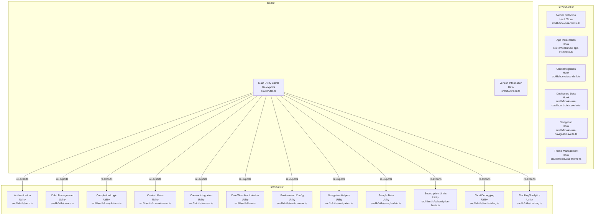
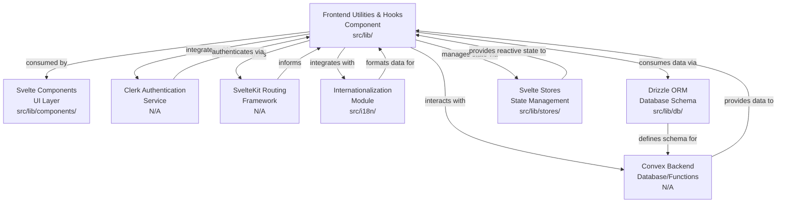

# Codebase Research Report

## Query
Investigate the "Frontend Utilities & Hooks" component in detail. Focus your analysis on these key directories:
1. /d:/GitHub/habistat/src/lib/
2. /d:/GitHub/habistat/src/lib/utils/
3. /d:/GitHub/habistat/src/lib/hooks/

These directories contain 18 files related to this component. Provide insights about the component's structure across these directories, its main responsibilities and functionality, and how it integrates with other system components.

## Answer
# Frontend Utilities & Hooks Component Analysis

The "Frontend Utilities & Hooks" component in the Habistat application is primarily responsible for providing reusable functions, helper modules, and reactive Svelte hooks that encapsulate common frontend logic, data fetching, state management, and UI-related functionalities. This component is distributed across three key directories: [src/lib/](d:/GitHub/habistat/src/lib/), [src/lib/utils/](d:/GitHub/habistat/src/lib/utils/), and [src/lib/hooks/](d:/GitHub/habistat/src/lib/hooks/).

## Component Structure and Responsibilities

### Core Utilities ([src/lib/utils/](d:/GitHub/habistat/src/lib/utils/))

This directory serves as a collection of general-purpose utility functions that support various aspects of the frontend application. These utilities are typically pure functions or small modules that perform specific tasks, making them easily testable and reusable across different components.

*   **Authentication Utilities** ([auth.ts](d:/GitHub/habistat/src/lib/utils/auth.ts)): Provides helper functions related to user authentication, likely interacting with the Convex backend for user sessions and data.
*   **Color Management** ([colors.ts](d:/GitHub/habistat/src/lib/utils/colors.ts)): Contains functions for handling and generating colors, potentially for UI theming or data visualization.
*   **Completion Logic** ([completions.ts](d:/GitHub/habistat/src/lib/utils/completions.ts)): Encapsulates logic related to habit completions, such as calculating streaks, progress, or formatting completion data.
*   **Context Menu Helpers** ([context-menu.ts](d:/GitHub/habistat/src/lib/utils/context-menu.ts)): Provides utilities for managing and interacting with context menus within the UI.
*   **Convex Integration Utilities** ([convex.ts](d:/GitHub/habistat/src/lib/utils/convex.ts)): Contains helper functions for interacting with the Convex backend, abstracting away direct API calls or data transformations specific to Convex.
*   **Date and Time Manipulation** ([date.ts](d:/GitHub/habistat/src/lib/utils/date.ts)): Offers a set of functions for formatting, parsing, comparing, and manipulating dates and times, crucial for habit tracking and scheduling features.
*   **Environment Configuration** ([environment.ts](d:/GitHub/habistat/src/lib/utils/environment.ts)): Manages environment-specific configurations, allowing the application to behave differently based on development, production, or other environments.
*   **Navigation Helpers** ([navigation.ts](d:/GitHub/habistat/src/lib/utils/navigation.ts)): Provides functions to assist with client-side routing and navigation within the SvelteKit application.
*   **Sample Data Generation** ([sample-data.ts](d:/GitHub/habistat/src/lib/utils/sample-data.ts)): Contains logic for generating sample data, useful for development, testing, or demonstrating features without real user data.
*   **Subscription Limit Management** ([subscription-limits.ts](d:/GitHub/habistat/src/lib/utils/subscription-limits.ts)): Implements logic to enforce and check subscription-based feature limits.
*   **Tauri Debugging Utilities** ([tauri-debug.ts](d:/GitHub/habistat/src/lib/utils/tauri-debug.ts)): Provides specific utilities for debugging when the application is running within the Tauri desktop framework.
*   **Tracking and Analytics** ([tracking.ts](d:/GitHub/habistat/src/lib/utils/tracking.ts)): Contains functions for sending analytics events or tracking user interactions.

### Frontend Hooks ([src/lib/hooks/](d:/GitHub/habistat/src/lib/hooks/))

This directory houses Svelte-specific "hooks" (often implemented as Svelte stores or reactive functions) that provide encapsulated, reusable logic for managing state, side effects, and interactions with the application's data layer or external APIs.

*   **Mobile Device Detection** ([is-mobile.ts](d:/GitHub/habistat/src/lib/hooks/is-mobile.ts)): A utility or store that detects if the application is running on a mobile device, allowing for responsive UI adjustments.
*   **Application Initialization Hook** ([use-app-init.svelte.ts](d:/GitHub/habistat/src/lib/hooks/use-app-init.svelte.ts)): Likely a reactive hook that handles initial application setup, data loading, or authentication checks when the application starts.
*   **Clerk Integration Hook** ([use-clerk.ts](d:/GitHub/habistat/src/lib/hooks/use-clerk.ts)): Provides a reactive interface for interacting with the Clerk authentication service, managing user sessions and authentication states.
*   **Dashboard Data Hook** ([use-dashboard-data.svelte.ts](d:/GitHub/habistat/src/lib/hooks/use-dashboard-data.svelte.ts)): A hook responsible for fetching, processing, and providing data specifically for the dashboard view, potentially aggregating information from various stores or Convex queries.
*   **Navigation Hook** ([use-navigation.svelte.ts](d:/GitHub/habistat/src/lib/hooks/use-navigation.svelte.ts)): Encapsulates navigation-related logic, possibly providing reactive access to current route information or methods for programmatic navigation.
*   **Theme Management Hook** ([use-theme.ts](d:/GitHub/habistat/src/lib/hooks/use-theme.ts)): Manages the application's theme (e.g., dark/light mode), providing reactive access to the current theme and methods to change it.

### General Library Utilities ([src/lib/](d:/GitHub/habistat/src/lib/))

While [src/lib/](d:/GitHub/habistat/src/lib/) contains a broad range of components (e.g., [components/](d:/GitHub/habistat/src/lib/components/)), it also includes a few top-level utility files that are fundamental to the application's operation.

*   **Main Utility Barrel File** ([utils.ts](d:/GitHub/habistat/src/lib/utils.ts)): This file likely re-exports or provides a central point of access for commonly used utilities from the [src/lib/utils/](d:/GitHub/habistat/src/lib/utils/) directory, simplifying imports for other parts of the application.
*   **Version Information** ([version.ts](d:/GitHub/habistat/src/lib/version.ts)): Stores and exports the application's version number, used for display or internal logic.

## Integration with Other System Components

The "Frontend Utilities & Hooks" component integrates deeply with various other parts of the Habistat application:

*   **Svelte Components:** Many Svelte components ([src/lib/components/](d:/GitHub/habistat/src/lib/components/)) consume these utilities and hooks to manage their internal state, fetch data, handle user interactions, and apply common UI patterns. For example, a dashboard component might use [use-dashboard-data.svelte.ts](d:/GitHub/habistat/src/lib/hooks/use-dashboard-data.svelte.ts) to get its data.
*   **Convex Backend:** Utilities like [convex.ts](d:/GitHub/habistat/src/lib/utils/convex.ts) and hooks like [use-dashboard-data.svelte.ts](d:/GitHub/habistat/src/lib/hooks/use-dashboard-data.svelte.ts) directly interact with the Convex database and functions, abstracting the data layer from the UI components.
*   **Authentication System (Clerk):** The [use-clerk.ts](d:/GitHub/habistat/src/lib/hooks/use-clerk.ts) hook provides the primary interface for frontend components to interact with the Clerk authentication service.
*   **Routing (SvelteKit):** The [navigation.ts](d:/GitHub/habistat/src/lib/utils/navigation.ts) utility and [use-navigation.svelte.ts](d:/GitHub/habistat/src/lib/hooks/use-navigation.svelte.ts) hook facilitate programmatic navigation and provide reactive access to route information, integrating with SvelteKit's routing capabilities.
*   **Internationalization (i18n):** While not directly part of these directories, date formatting utilities in [date.ts](d:/GitHub/habistat/src/lib/utils/date.ts) would likely integrate with the application's i18n system ([src/i18n/](d:/GitHub/habistat/src/i18n/)) to provide localized date displays.
*   **Database (Drizzle ORM):** The [db/](d:/GitHub/habistat/src/lib/db/) directory contains schema definitions ([schema.ts](d:/GitHub/habistat/src/lib/db/schema.ts)) and client/server configurations ([client.ts](d:/GitHub/habistat/src/lib/db/client.ts), [server.ts](d:/GitHub/habistat/src/lib/db/server.ts)) for Drizzle ORM. While not directly in `utils` or `hooks`, the data fetched via Convex (which might use Drizzle internally) is consumed by hooks like [use-dashboard-data.svelte.ts](d:/GitHub/habistat/src/lib/hooks/use-dashboard-data.svelte.ts).
*   **Stores (Svelte Stores):** Many hooks and utilities interact with or manage Svelte stores ([src/lib/stores/](d:/GitHub/habistat/src/lib/stores/)) to provide reactive state management across the application. For example, [use-theme.ts](d:/GitHub/habistat/src/lib/hooks/use-theme.ts) would likely interact with a theme-related store.

---
*Generated by [CodeViz.ai](https://codeviz.ai) on 7/26/2025, 2:56:31 PM*
